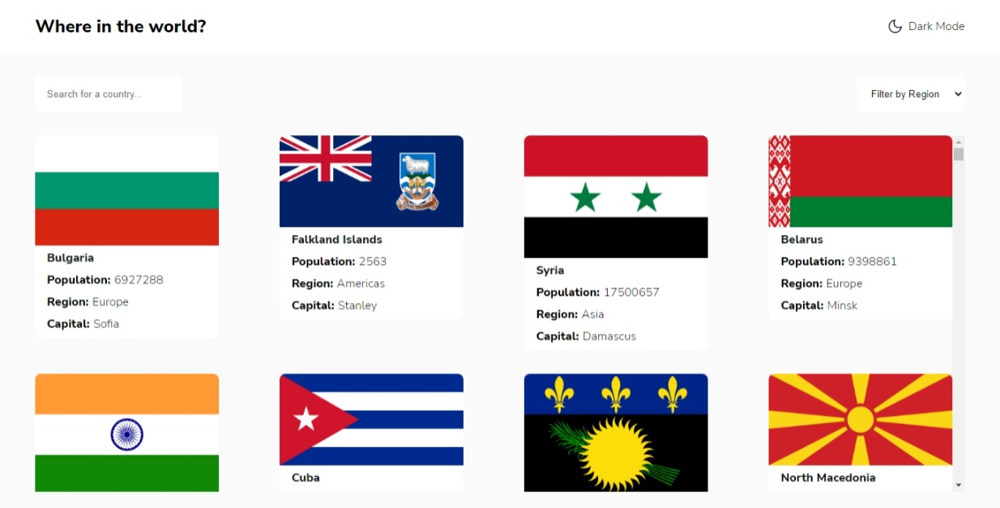
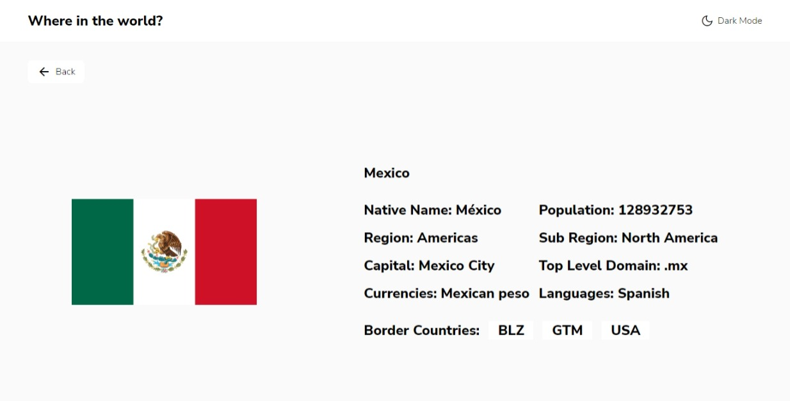

# Frontend Mentor - REST Countries API with color theme switcher solution

This is a solution to the [REST Countries API with color theme switcher challenge on Frontend Mentor](https://www.frontendmentor.io/challenges/rest-countries-api-with-color-theme-switcher-5cacc469fec04111f7b848ca).

## Table of contents

- [Overview](#overview)
  - [The challenge](#the-challenge)
  - [Screenshot](#screenshot)
  - [Links](#links)
- [My process](#my-process)
  - [Built with](#built-with)
  - [What I learned](#what-i-learned)
  - [Continued development](#continued-development)
- [Author](#author)

## Overview

### The challenge

Users should be able to:

- [x] See all countries from the API on the homepage
- [x] Search for a country using an `input` field
- [x] Filter countries by region
- [x] Click on a country to see more detailed information on a separate page
- Click through to the border countries on the detail page
- [x] Toggle the color scheme between light and dark mode *(optional)*

### Screenshot




**Note: Add video.**

### Links

- Solution URL: [GitHub](https://github.com/im-victor-mendez/React-Countries_REST_API)
- Live Site URL: [Netlify](https://rest-country-im-victor-mendez.netlify.app/)

## My process

### Built with

- [React JS](https://reactjs.org/) - JS library
- Redux
- Semantic HTML5 markup
- SCSS

### What I learned

- How to do a toggle Dark Mode.
- Use Redux properly.
- Access to variable object keys.
  ```js
  const vk = [/*Variable Key*/]
  object.key1[vk]
  ```

### Continued development

- I had a problems with filter selector: when you select a option, the placeholder don't change.
- Performance problems when get country list.

## Author

- [LinkedIn](https://www.linkedin.com/in/im-victor-mendez/)
- Frontend Mentor - [@im-victor-mendez](https://www.frontendmentor.io/profile/im-victor-mendez)
- GitHub - [@im-victor-mendez](https://github.com/im-victor-mendez)
